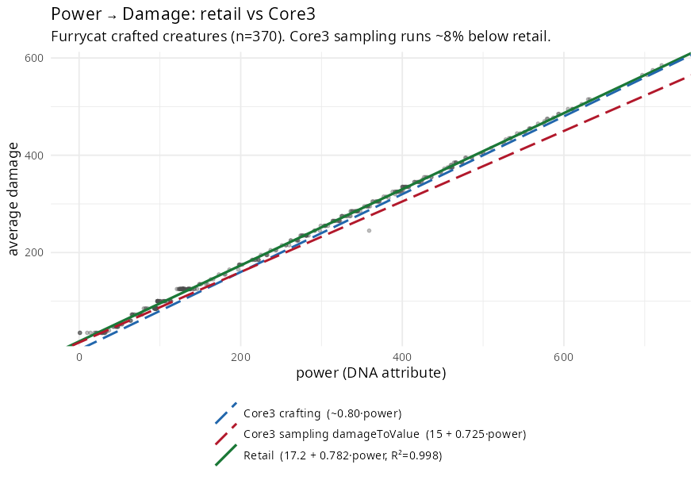

# SWGEmu / Core3 divergences from retail

A registry of places where the SWGEmu (Core3) implementation measurably differs
from the historical retail behavior reconstructed from the Furrycat data. The
goal is to make Core3 more accurate to retail: each entry states the retail
behavior (with evidence), the Core3 behavior (with source citations), the size
and direction of the divergence, the gameplay impact, and a recommended change.

Core3 paths are given relative to the Core3 tree
(`MMOCoreORB/src/...`); they were read from the copy at
`../dna-lab/submodules/Core3/`.

| # | Divergence | Severity | Status |
|---|---|---|---|
| D1 | Power → Damage sampling (`damageToValue`) runs ~8% low | Medium (affects power → CL) | Documented, fix proposed |
| D2 | Creature-level formula over-levels retail (esp. low-CL/high-HAM) | High | See `core3_comparison.Rmd` + `creature_level_investigation_review.md` |
| D3 | Dependability `dietToValue` mapping is wrong | Low (dependability ≉ CL) | Documented, low priority |

---

## D1 — Power ↔ Damage: `damageToValue` sampling constant runs ~8% low

**Summary.** When Core3 samples a wild creature, it converts the creature's
damage into the DNA `power` stat via `Genetics::damageToValue`. That conversion
uses a slope (~0.725 in power→damage terms) that is ~8% shallower than retail
(0.782), so Core3 **over-assigns `power` from a creature's damage** by ~8%
relative to retail. Because `power` drives crafted damage *and* creature level,
wild-sampled DNA — and everything bred/crafted from it — skews high vs retail.

### Retail behavior (evidence)

Across the 370 cleaned Furrycat crafted creatures, average damage is an almost
perfectly linear function of the `power` attribute:

```
avg_damage = 17.22 + 0.7823 · power        R² = 0.9983,  n = 370,  residual SD = 5.5 dmg
```

Piecewise (matches the kink noted in `damage_analysis.Rmd`):

```
power ≤ 369:  avg_damage = 18.00 + 0.7768 · power   (R² = 0.9941, n = 265)
power >  369: avg_damage = 13.66 + 0.7903 · power   (R² = 0.9985, n = 105)
```

`avg_damage = (damage_low + damage_high) / 2` from `creatures.csv`; `power` from
`templates.csv`. The fit is tight enough (residual SD ≈ 5 damage) to treat
`0.78 · power` as the retail power→damage relationship.



### Core3 behavior (source)

Core3 has **two** power↔damage constants, and they disagree with each other:

- **Sampling** (damage → power), `Genetics.h:256`
  (`MMOCoreORB/src/server/zone/managers/crafting/labratories/Genetics.h`):
  ```cpp
  static int damageToValue(float dps, int quality) {
      int base = round(((dps - 15.0) / (725.0)) * 1000.0);   // slope 0.725 in power→dmg terms
      return randomizeValue(base, quality);
  }
  ```
- **Crafting** (power → damage), `GeneticComponentImplementation.cpp:241`
  (`MMOCoreORB/src/server/zone/objects/tangible/component/genetic/`):
  ```cpp
  float damage = (power * 0.8f) / 10.0f;   // effective ~0.80 · power after the ×10 below
  ```

### The divergence

| power → avg damage (slope) | source |
|---|---|
| **0.782** (R² = 0.998) | **retail** (Furrycat, this project) |
| 0.80 | Core3 crafting (`GeneticComponentImplementation.cpp:241`) |
| 0.725 | Core3 sampling (`Genetics.h:256`) |

Retail (0.782) sits right next to Core3's *crafting* constant (0.80); Core3's
*sampling* constant (0.725) is the outlier — inconsistent with retail **and**
with Core3's own crafting. Damage predicted from a given power:

| power | retail dmg | Core3 sampling | Core3 crafting |
|---|---|---|---|
| 100 | 95 | 88 (−8%) | 80 |
| 300 | 252 | 232 (−8%) | 240 |
| 500 | 408 | 378 (−8%) | 400 |
| 700 | 565 | 522 (−7%) | 560 |

Equivalently, inverting to the sampling direction: for a creature of a given
damage, Core3 assigns ~8–9% **more** `power` than retail would.

### Impact

`power` feeds both crafted damage and the creature-level calculation, so a
sampling bias on `power` propagates: wild-sampled DNA carries too much power →
crafted pets get more damage and higher CL than the same wild creature would
have yielded at retail. This is a systematic, one-directional skew (not noise),
concentrated on high-damage predators (merek, rancor, graul, etc.).

Note this is **Core3's** behavior, not a DNA Lab defect — DNA Lab's standalone
simulator faithfully mirrors both Core3 constants. The fix belongs in the Core3
server, not in DNA Lab (which should keep replicating whatever Core3 does).

### Recommended change

In `Genetics::damageToValue`, bring the sampling constant in line with retail
(and with Core3's own crafting formula):

```cpp
// was: round(((dps - 15.0) / 725.0) * 1000.0)
int base = round(((dps - 17.0) / 782.0) * 1000.0);
```

This matches the measured retail slope (0.782) and removes the sampling/crafting
inconsistency. (Matching crafting exactly instead — denominator ~800 — would be
within measurement noise of retail as well.)

### Sample quality is not a confound

DNA-sample quality (VHQ … VLQ) shifts a sampled stat by a fixed amount — in
`randomizeValue`, VHQ = base **+10..+20**, down to VLQ = base **−20..−10** — and
VHQ samples legitimately exceed the source creature. This does **not** explain
D1:

- D1 is measured on *crafted* creatures' final `power` → final `damage`, which is
  deterministic (R² = 0.998). Quality is baked into the `power` value; it does not
  alter the power→damage mapping.
- Quality is a fixed additive offset (≤ ±20); D1 is a multiplicative ~8% slope
  gap that grows with power (≈ 43 damage at power 700) — a different shape.
- The slope is stable across quality tiers (0.767 / 0.781 / 0.784 ≈ 0.78), never
  0.725.

Mechanically, quality is the `randomizeValue(base, quality)` window applied *on
top of* the base; D1 is entirely in the base constant (`725`). The two are
orthogonal, and the DNA-sample validator already accounts for quality via
`sampleWindow(base, quality)`.

### Caveat

Retail's *crafting* direction (power → damage) is directly measured here
(R² = 0.998). Retail's *sampling* constant is not independently observed, so the
exact target denominator (782 vs ~800) is inferred from self-consistency and the
crafting fit. The **direction and magnitude are unambiguous**: Core3's 0.725 is
~8% too low.

### Reproduction

```r
source("R/data.R")
d <- subset(normalized_df, power > 0)
d$avg_dmg <- (d$damage_low + d$damage_high) / 2
summary(lm(avg_dmg ~ power, d))          # 17.2 + 0.782*power, R^2 0.998
```

The DNA-sample validator surfaces the same divergence as a Tier-3 flag:

```
dna-lab-validate --creatures optimizer/creatures.json data/clean/furrycat/samples.csv
# power: 497 of 498 wild-sample violations are "below_source_min" (systematic)
```

---

## D2 — Creature level over-levels retail (reference)

Core3's `Genetics::calculatePetLevel` over-predicts retail creature levels
(RMSE ≈ 5.4 vs a reverse-engineered model's ≈ 1.8), with a systematic **+~7
overshoot at low CL** that decays to ~0 by CL 30. A likely structural cause:
retail's unarmored CL includes a direct **negative fortitude term** that Core3's
combat-stat-only formula cannot express. Full evidence:
`core3_comparison.Rmd` and `docs/creature_level_investigation_review.md` (§1).

## D3 — Dependability `dietToValue` mapping is wrong (reference)

Sampled `dependability` is a tight per-source constant (within-source spread
~15) that does **not** follow Core3's `dietToValue` (herbivore = 750 /
carnivore = 500): carnivores span 504–1000 and herbivores 503–758 in the
Furrycat data (e.g. herbivore `durni` samples at ~503, not 750). Low priority —
dependability does not measurably affect creature level. Reverse-engineerable as
a per-source table if ever needed.
